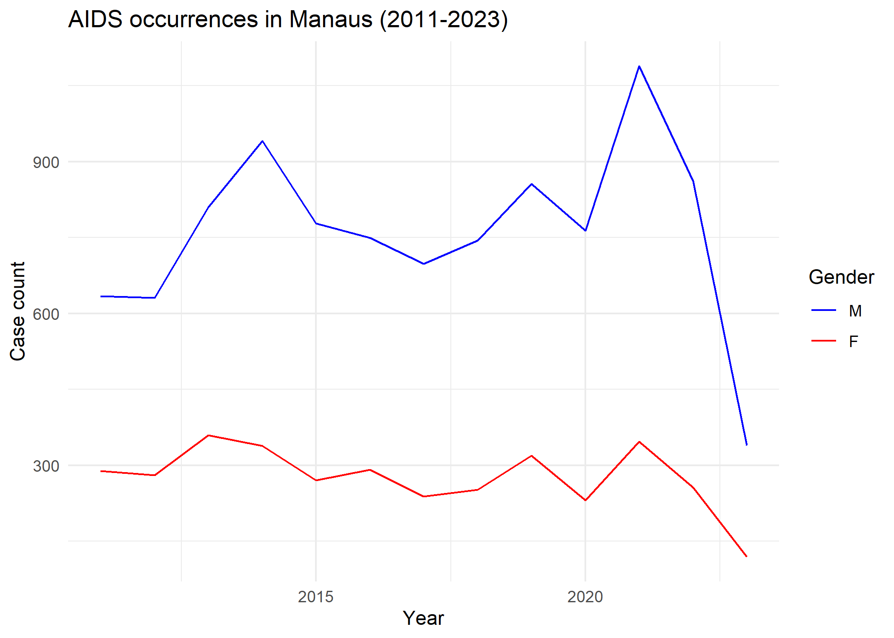
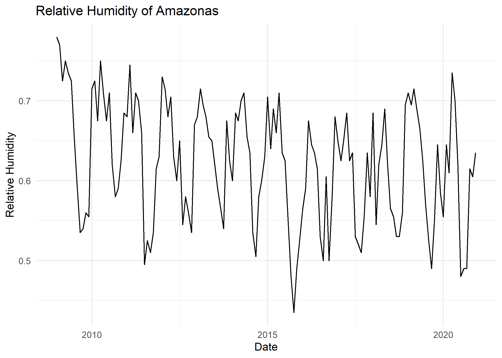

<!-- README.md is generated from README.Rmd. Please edit that file -->

# amazonasdatahub 

<!-- badges: start -->

<!-- badges: end -->

The goal of `amazonasdatahub` is to aggregate databases from the State
of Amazonas (AM), Brazil, for conducting studies and preparing
educational materials, as well as to facilitate access to organized and
processed data, thereby supporting research and teaching and enabling
the application of statistical methods.

Full documentation of both Python and R versions is available in the
following languages/Documentação das versões em Python e R estão
disponíveis nos seguintes idiomas:

- [English](https://onelsoncarvalho/amazonasdatahubsite/en);
- [🇧🇷 Português (BR)](https://onelsoncarvalho/amazonasdatahubsite);

R only documentation and vignettes:

- [English](https://onelsoncarvalho/amazonasdatahub);
- [🇧🇷 Português (BR)](https://onelsoncarvalho/amazonasdatahub/br);

## Overview

This `amazonasdatahub` package provides databases from various types and
sources, all of which concern the State of Amazonas.

List of available datasets:

| Dataset | Area | Source |
|:---|:--:|:---|
| agriculture_amazonas | Agriculture and Livestock | Institute of Agricultural and Sustainable Forestry Development of the State of Amazonas - 2024 |
| aids_amazonas | Health | Department of HIV, AIDS, Tuberculosis, Viral Hepatitis, and Sexually Transmitted Infections, 2024 |
| gdp_amazonas | Economy | Scientific Journal of Applied Social and Clinical Science - TIME SERIES ANALYSIS FOR THE QUARTERLY GROSS DOMESTIC PRODUCT OF AMAZONAS |
| humidity_manaus | Climate | NASCIMENTO, Leonardo Brandão Freitas; LIMA, Max Sousa; DUCZMAL, Luiz H. P-min-stable regression models for time series with extreme values of limited range. Environmetrics, Issue 2, v. 36, 2025. |
| malaria_amazonas | Health | Lais Baroni, M. P. (2020). An Integrated Dataset of Malaria Notifications in the Legal Amazon (Dataset). Synapse. <https://doi.org/10.7303/SYN21552203> |
| prf_amazonas | Road Safety | Brasil. Polícia Rodoviária Federal (PRF). Dados Abertos da PRF: Acidentes de Trânsito |
| rionegro_amazonas | Environment | Porto de Manaus. Nível do Rio Negro |
| srl_muni | Education | ALMEIDA, Thiago da Cruz de. Physical Literacy e desempenho em leitura de escolares amazônicos: um estudo de associação. 2024. 104 f. Dissertação (Mestrado em Educação) - Universidade Federal do Amazonas, Manaus, 2024. |

## Installation

To install `amazonasdatahub`, you need to have the following tools
installed on your computer or development environment:

- R version 4.41.1 (2024-06-14) or above;
- `remotes` package from R.

You can install the development version of `amazonasdatahub` with:

``` r
# Install remotes package
install.packages("remotes")

# Load remotes
library(remotes)

# installing amazonasdatahub
remotes::install_github("onelsoncarvalho/amazonasdatahub")
```

## Usage and Examples

### Loading `amazonasdatahub`

Use `library()` or `require()` to load the package.

``` r
library(amazonasdatahub)
```

You can check the documentation of each dataset using the help operator
“?”.

``` r
?agriculture_amazonas
?aids_amazonas
?gdp_amazonas
?humidity_manaus
?malaria_amazonas
?prf_amazonas
?rionegro_amazonas
?slr_muni
```

### Usage examples

#### Disease occurrence

The dataset `aids_amazonas` contains data of the AIDS occurrences in
each municipality from Amazonas.

One of the analysis that can be made is: visualize the time series of
counts filtered by municipality, where each case is grouped by the
sex/gender of each observation. To do this, we will use the dplyr
package to structure the data and the ggplot2 package to create and
customize the chart.

``` r
# Loading dplyr and ggplot to structure the data
require(dplyr)
require(ggplot2)
```

``` r
# Filtering by municipality and plotting case count by gender
aids_amazonas %>%
  filter(name_muni == "Manaus") %>%
  group_by(gender) %>%
  ggplot(aes(x = year, y = cases, group = gender, color = gender)) +
  geom_line() +
  scale_color_manual(values = c("blue", "red")) +
  theme_minimal() +
  labs(
    title = "AIDS occurrences in Manaus (2011-2023)",
    x = "Year",
    y = "Case count",
    color = "Gender"
  )
```



#### Time Series

The `humidity_manaus` consists of the minimum relative humidity observed
in the city of Manaus from January 2009 to December 2020. We can
visualize the time series of the relative humidity during this time
interval.

Using `dplyr`, it is possible to create a date column, which will be
composed of the month and year. Using`ggplot2`, the time series chart
can be plotted.

``` r
# Loading dplyr and ggplot to structure the data
require(dplyr)
require(ggplot2)

# Creating date column and plotting the time series
humidity_manaus %>%
  mutate(date = as.Date(paste0(year, "-", month, "-","01"))) %>%
  ggplot(aes(x = date, y = rh)) +
  geom_line() +
  theme_minimal() +
  labs(
    title = "Relative Humidity of Amazonas",
    x = "Date",
    y = "Relative Humidity"
  )
```



## Citation

- CARVALHO, Nelson Geraldo Aquino de; NASCIMENTO, Leonardo Brandão
  Freitas do. **amazonasdatahub**. 2026.
  <https://onelsoncarvalho.github.io/amazonasdatahubsite>.
