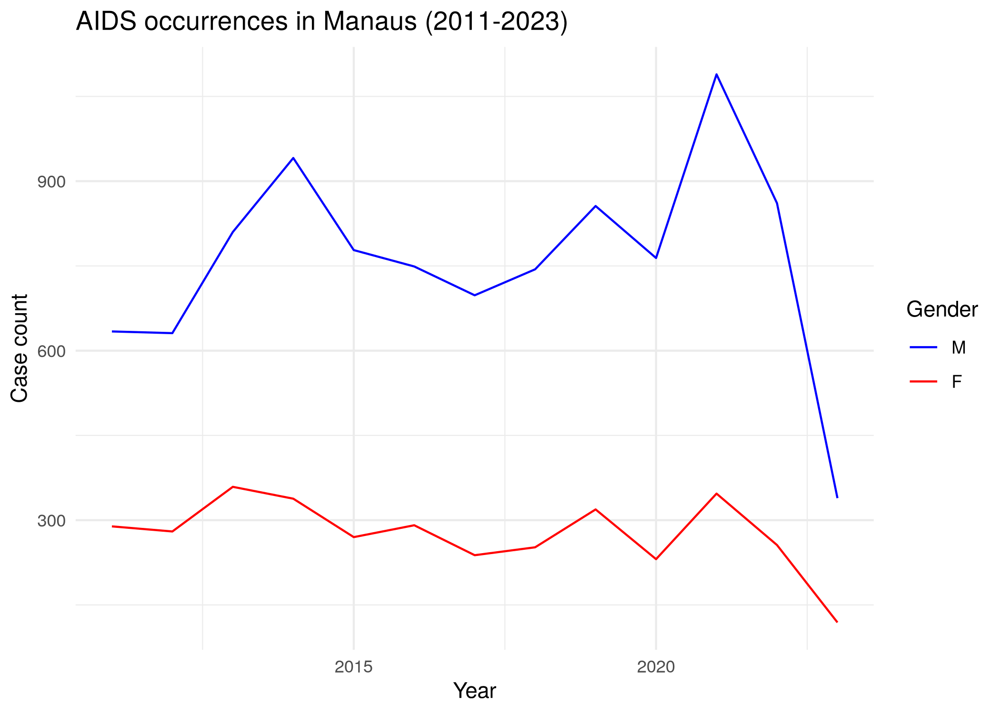
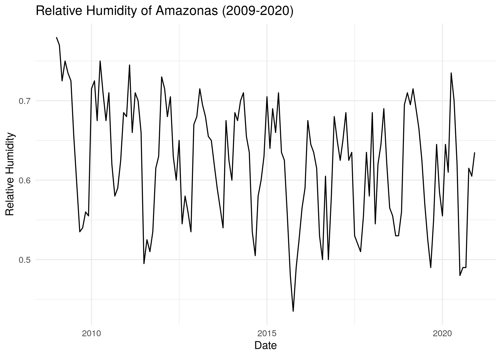

# amazonasdatahub

O objetivo do `amazonasdatahub` é reunir bases de dados do Estado do
Amazonas (AM), para a realização de estudos e preparação de materiais
didáticos, além de facilitar o acesso a dados tratados e organizados,
viabilizando pesquisa e ensino e permitindo a aplicação de métodos
estatísticos.

A documentação completa de ambas as versões em Python e R estão
disponíveis nos seguintes idiomas:

- [English
  documentation](https://onelsoncarvalho.github.io/amazonasdatahubsite/en);
- [🇧🇷 Documentação em Português
  (BR)](https://onelsoncarvalho.github.io/amazonasdatahubsite);

Documentação da versão em R e vignettes:

- [English documentation for R
  version](https://onelsoncarvalho.github.io/amazonasdatahub)
- [🇧🇷 Documentação em Português (BR) para versão do
  R](https://onelsoncarvalho.github.io/amazonasdatahub/br)

## Visão Geral

O pacote `amazonasdatahub` disponibiliza bases de dados de diversos
tipos e fontes, e todas estão ligadas ao Estado do Amazonas.

Lista das bases de dados disponíveis:

| Base de dados | Área | Fonte |
|:---|:--:|:---|
| agriculture_amazonas | Agriculture and Livestock | Institute of Agricultural and Sustainable Forestry Development of the State of Amazonas - 2024 |
| aids_amazonas | Health | Department of HIV, AIDS, Tuberculosis, Viral Hepatitis, and Sexually Transmitted Infections, 2024 |
| gdp_amazonas | Economy | Scientific Journal of Applied Social and Clinical Science - TIME SERIES ANALYSIS FOR THE QUARTERLY GROSS DOMESTIC PRODUCT OF AMAZONAS |
| humidity_manaus | Climate | NASCIMENTO, Leonardo Brandão Freitas; LIMA, Max Sousa; DUCZMAL, Luiz H. P-min-stable regression models for time series with extreme values of limited range. Environmetrics, Issue 2, v. 36, 2025. |
| malaria_amazonas | Health | Lais Baroni, M. P. (2020). An Integrated Dataset of Malaria Notifications in the Legal Amazon (Dataset). Synapse. <https://doi.org/10.7303/SYN21552203> |
| prf_amazonas | Road Safety | Brasil. Polícia Rodoviária Federal (PRF). Dados Abertos da PRF: Acidentes de Trânsito |
| rionegro_amazonas | Environment | Porto de Manaus. Nível do Rio Negro |
| srl_muni | Education | ALMEIDA, Thiago da Cruz de. Physical Literacy e desempenho em leitura de escolares amazônicos: um estudo de associação. 2024. 104 f. Dissertação (Mestrado em Educação) - Universidade Federal do Amazonas, Manaus, 2024. |

## Instalação

Para instalar o `amazonasdatahub`, é necessário ter as seguintes
ferramentas instaladas no seu computador ou ambiente de desenvolvimento:

- R versão 4.41.1 (2024-06-14) ou superior;
- Pacote `remotes` no R.

Você pode instalar a versão de desenvolvimento do `amazonasdatahub` com:

``` r
# Instalando o pacote remotes
install.packages("remotes")

# Carregando o remotes
library(remotes)

# Instalando o amazonasdatahub
remotes::install_github("onelsoncarvalho/amazonasdatahub")
```

## Uso e Exemplos

### Carregando `amazonasdatahub`

Use a função [`library()`](https://rdrr.io/r/base/library.html) ou
[`require()`](https://rdrr.io/r/base/library.html) para carregar o
pacote.

``` r
library(amazonasdatahub)
```

Você pode acessar a documentação de cada base de dados usando o operador
de ajuda “`?`”.

``` r
?agriculture_amazonas
?aids_amazonas
?gdp_amazonas
?humidity_manaus
?malaria_amazonas
?prf_amazonas
?rionegro_amazonas
?slr_muni
```

### Exemplos

#### Incidência de doenças

A base de dados `aids_amazonas` fornece dados das ocorrências de AIDS
nos municípios do Amazonas.

Uma das análises que podem ser feitas é: verificar a série temporal da
contagem de casos filtrado de determinado município, onde os casos são
agrupados pelo sexo do indivíduo observado. Para fazer isso,
utilizaremos os pacotes `dplyr` para estruturar os dados, e o `ggplot`
para fazer o gráfico e customizá-lo.

``` r
# Loading dplyr and ggplot to structure the data
require(dplyr)
require(ggplot2)
```

``` r
# Filtrando por município e plotando a contagem de casos por gênero
aids_amazonas %>%
  filter(name_muni == "Manaus") %>%
  group_by(gender) %>%
  ggplot(aes(x = year, y = cases, group = gender, color = gender)) +
  geom_line() +
  scale_color_manual(values = c("blue", "red")) +
  theme_minimal() +
  labs(
    title = "Contagem de casos de AIDS em Manaus (2011-2023)",
    x = "Ano",
    y = "Contagem",
    color = "Gênero"
  )
```



#### Séries Temporais

Com o conjunto de dados `humidity_manaus`, que reune dados de umidade
relativa observados na cidade de Manaus de janeiro de 2009 a dezembro de
2020, podemos verificar séries temporais, e dentre elas, a da umidade
relativa durante esse intervalo de tempo.

Usando `dplyr`, podemos criar uma coluna de data, que será composta
pelos dados de mês e ano, e com o `ggplot2`, podemos criar o gráfico.

``` r
# Carregando o dplyr e ggplot2
require(dplyr)
require(ggplot2)

# Criando variavel de data unindo ano e mes, e em seguida,
# plotando o grafico
humidity_manaus %>%
  mutate(date = as.Date(paste0(year, "-", month, "-","01"))) %>%
  ggplot(aes(x = date, y = rh)) +
  geom_line() +
  theme_minimal() +
  labs(
    title = "Umidade Relativa de Manaus (2009 - 2020)",
    x = "Data",
    y = "Umidade Relativa"
  )
```



## Citação

- CARVALHO, Nelson Geraldo Aquino de; NASCIMENTO, Leonardo Brandão
  Freitas do. **amazonasdatahub**. 2026.
  <https://onelsoncarvalho.github.io/amazonasdatahub>.
