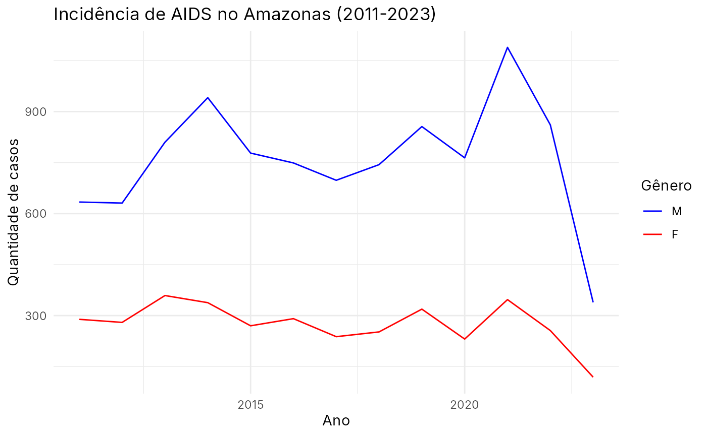

# aids_amazonas

Uma base de dados de ocorrências de AIDS de 2011 a 2023 no Amazonas.

### Descrição

Essa base de dados possui registros das ocorrências de AIDS de 2011 a
2023 em cada município do Amazonas.

### Uso

``` r
aids_amazonas
```

### Formato

‘aids_amazonas’ Um data frame com 1612 linhas e 5 colunas:

#### code_muni

Código do município

#### name_muni

Nome do município

#### cases

Contagem de casos

#### gender

Gênero do indivíduo (M para Masculino e F para Feminino)

#### year

Ano da observação

### Fonte

BRASIL. Ministério da Saúde. Departamento de HIV, Aids, Tuberculose,
Hepatites Virais e Infecções Sexualmente Transmissíveis. Indicadores
HIV, Aids. Available in: <https://indicadores.aids.gov.br/>.

### Exemplos

``` r
require(dplyr)
require(ggplot2)
require(amazonasdatahub)

# Filtrando por município e agrupando por gênero
aids_amazonas %>%
  filter(name_muni == "Manaus") %>%
  group_by(gender) %>%
  ggplot(aes(x = year, y = cases, group = gender, color = gender)) +
  geom_line() +
  scale_color_manual(values = c("blue", "red")) +
  theme_minimal() +
  labs(
    title = "Incidência de AIDS no Amazonas (2011-2023)",
    x = "Ano",
    y = "Quantidade de casos",
    color = "Gênero"
  )
```


