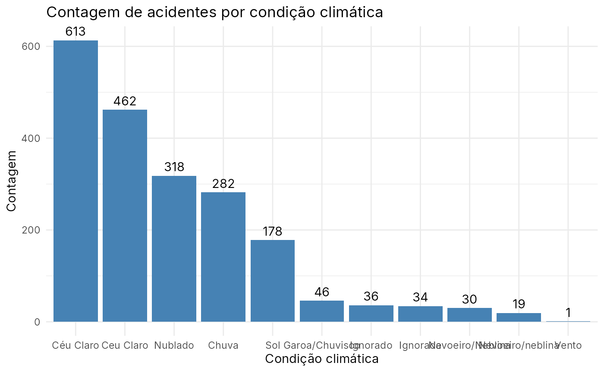

# prf_amazonas

Dados de acidentes registrados pela Polícia Rodoviária Federal no
Amazonas em 2025

### Descrição

Registros feitos pela Polícia Rodoviária Federal sobre acidentes que
aconteceram no Amazonas em 2025

### Uso

``` r
prf_amazonas
```

### Formato

‘prf_amazonas’ Um data frame com 116 linhas e 30 variáveis:

#### school

#### id

Identificador do registro

#### date

Data do registro (aaaa-mm-dd)

#### days_of_week

Dia da semana

#### time

Hora do registro

#### federative_unit

Unidade federativa (UF)

#### br

Rodovia Federal (BR)

#### km

Quilômetro da BR

#### municipality

Município

#### accident_cause

Causa do acidente

#### accident_type

Tipo de acidente

#### accident_classification

Classificação do acidente: com vítimas, sem vítimas, vítimas ilesas,
vítimas fatais

#### road_direction

Sentido da via

#### weather

Condições meteorológicas no momento do acidente

#### track_type

Tipo de pista: Simples, Múltipla ou Dupla

#### track_layout

Traçado da pista

#### land_use

Uso do solo

#### people

Pessoas envolvidas no acidente

#### deceased

Número de mortos

#### minor_injuries

Número de vítimas com ferimentos leves

#### serious_injuries

Número de vítimas com ferimentos graves

#### unharmed

Número de vítimas ilesas

#### ignored

Ignorado

#### harmed

Número de vítimas feridas

#### latitude

Latitude

#### longitude

Longitude

#### regional

Superintendência da Polícia Rodoviária Federal do Brasil

#### police_station

Delegacia onde o registro foi realizado

#### operating_unit

Unidade operacional e delegacia responsável

### Fonte

Brasil. Polícia Rodoviária Federal (PRF). Dados Abertos da PRF:
Acidentes de Trânsito.
<https://www.gov.br/prf/pt-br/acesso-a-informacao/dados-abertos/dados-abertos-da-prf>.

### Exemplos

``` r
require(dplyr)
require(forcats)
require(ggplot2)
require(amazonasdatahub)

# Contando acidentes agrupados por condicao climatica e plotando o grafico
prf_amazonas %>%
  count(weather) %>%
  mutate(
    weather = fct_reorder(weather, -n)
  ) %>%
  ggplot(aes(x = weather, y = n)) +
  geom_bar(stat = "identity", fill = "steelblue") +
  geom_text(aes(label = n), vjust = -0.5) +
  theme_minimal() +
  labs(
    title = "Contagem de acidentes por condição climática",
    x = "Condição climática",
    y = "Contagem"
  )
```


